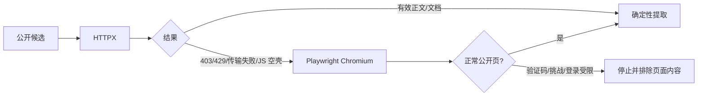
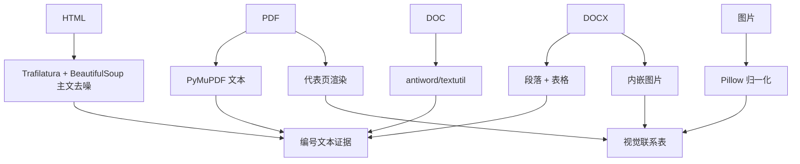
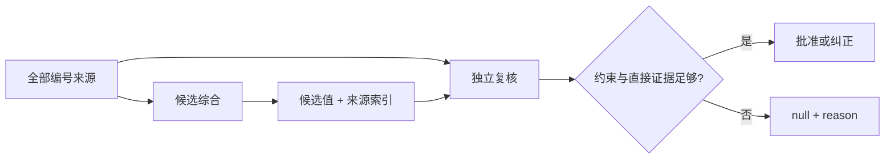

# ADR-0004：质量优先的多源网页采集与浏览器回退

## 状态

已接受，已于 2026-08-24 在本地在线任务中验证。

其中来源发现顺序已由 [ADR-0006](0006-direct-source-first-and-row-isolation.md) 修订为“采集直链优先、必要时搜索降级”；“所有 unit 固定双阶段模型判定”仍由 [ADR-0005](0005-p0-state-throughput-review-and-gold-boundary.md) 确认为质量契约。两阶段都使用同一 `Qwen3.8-27B-6bit`，全局并发固定为 1，不得做多行模型批处理。

## 背景

单一搜索摘要或单一 HTTP 页面不足以支撑高质量的行级指标采集：

- 搜索摘要可能截断、过期或缺少口径；
- 部分公开页面返回 403，或静态 HTML 只含 JavaScript 空壳；
- PDF、Word、扫描页、图表和网页图片包含文本主体之外的关键信息；
- 验证码、登录墙和挑战页不应被当作业务证据；
- 本地模型较慢，用户明确选择“时间不敏感、质量敏感”。

## 决策

### 1. 采集直链优先、SearXNG 降级发现

工作簿已给出采集直链时，先规范化、抓取、解析并按当前 `RowContract` 做唯一匹配；只有获取失败、目标缺失或匹配歧义时才从 SearXNG 获取前 10 条合法公网结果。没有直链时直接进入搜索降级。搜索请求全局串行，默认最小间隔 60 秒，具体审计契约见 ADR-0006。

### 2. HTTP 优先，Chromium 有界回退

Chromium 在同一批候选中复用一个临时上下文，串行处理，不持久化 Cookie。当页面恢复成功时，提取渲染后 DOM 主文，下载候选图片，并保留当前主区域视口截图。

### 3. 不实施验证码规避

系统只处理正常公开页面，不实施以下能力：

- 验证码识别/解答；
- `navigator.webdriver` 等隐身脚本注入；
- 持久化真实用户登录态；
- 代理轮换、指纹伪造或绕过付费/登录控制。

命中验证码/挑战信号后，恢复原始请求 URL，清空挑战页文本和图像，只保留失败原因。

### 4. 主内容和文档视觉联合证据

网页导航、页头、页脚、旁栏、表单、脚本和样式不进入主文。单源最多保留 2 张视觉图，联系表最多包含 6 张图，以限制本地多模态请求负载。

### 5. 双阶段模型判定

复核重新检查日期/统计期、地域层级、指标定义、总体范围和单位。“附近出现了一个数字”不构成直接证据。

## 配置基线

| 参数 | 当前值 |
| --- | ---: |
| SearXNG 最小调用间隔 | 60 秒 |
| 来源 HTTP 并发 | 3 |
| 持久化来源缓存有效期 | 24 小时；任务内存缓存持续到进程结束 |
| 浏览器超时 | 180 秒 |
| 浏览器稳定等待 | 5 秒 |
| 浏览器回退正文阈值 | 500 字符 |
| 同域浏览器冷却 | 30 秒 |
| OMLX 超时 | 900 秒 |
| OMLX 并发 | 1 |

## 后果

### 正面

- 在不默认启动浏览器的前提下，可恢复很多 403 和 JavaScript 页面的公开内容；
- PDF/Word/网页图片与主文在同一证据编号体系中参与判定；
- 验证码页不会污染模型输入；
- 独立复核显著降低地域子集、错月份和错口径数字的静默写入。

### 代价

- 单个采集单元通常需要数分钟，极端情况可更长；
- Playwright 和 Chromium 增加本地/容器磁盘和内存开销；
- 浏览器回退仍不能保证访问所有公开页面；
- 搜索引擎的结果覆盖与可用性仍需长期监视。

## 验证

- 公开 JavaScript 测试页成功从静态空壳恢复 1,071 字符正文和渲染截图；
- 微信文章重定向验证码页后被正确排除；
- ICLR、巴西人工智能创新指数和广东大模型备案数量三个在线生产单元都在证据不足时返回 `null`，没有使用不同地域/日期/口径的数字补空；
- 32 个非 acceptance/非 OMLX 测试通过，Ruff、uv 锁文件和 Docker Compose 配置检查通过。
