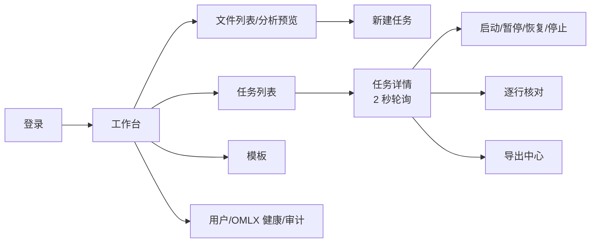
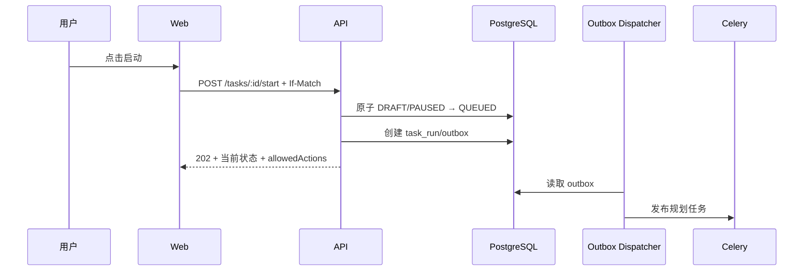
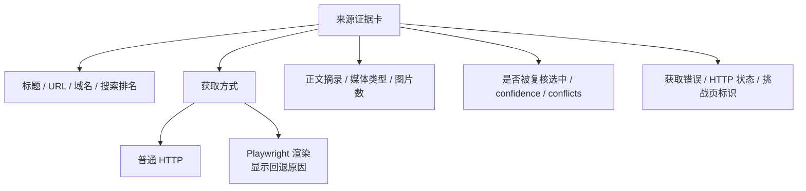

# metric-pulse-platform 应用设计

## 1. 文档信息

| 项目 | 内容 |
| --- | --- |
| 文档版本 | v1.6 |
| 状态 | 当前实现同步稿 + 已批准 P0 交互目标 |
| 更新日期 | 2026-08-24 |
| 覆盖范围 | Python 后端应用、Web 前端、API、主要用例和交互 |

## 2. 应用目标

应用必须让普通用户以尽量少的操作完成：

1. 上传工作簿；
2. 确认自动识别的采集方案；
3. 启动并控制任务；
4. 主要核对异常、冲突和低置信度结果；
5. 让低风险且经确定性验证的结果按版本化策略自动通过，必要时对高质量结果受控批量确认；
6. 对已尽调查但无法安全填值的项直接“确认未解决”，无需伪造值；
7. 在全部纳入导出的数据通过审核门禁后下载正式工作簿和未解决报告。

应用不得要求用户理解队列、worker、模型 prompt、数据库表或复杂状态机。

交互上必须明确区分“系统是否执行完成”、“业务数据是否已解决”和“审核门禁是否已满足”，不能以一个“完成”误导用户。

对年度/月度增量表，核对页还应直接展示“本次快照时间、固定官方来源、批次数量、旧批次将在
正式导出时失效”等业务语义。福布斯 AI 50 审核卡展示公司、总部、首席执行官、官方融资原文、
确定性换算结果和成立年份；页面位置只作内部定位，不展示为福布斯排名。

### 2.1 当前已交付界面



当前 Web 已实现上述页面和 API 闭环。任务详情目前每 2 秒轮询，SSE 端点已存在但前端尚未把其作为主更新通道。核对页已能显示原始行、校验 JSON、审核历史、建议值、来源摘录和决策按钮；更精细的浏览器回退标识和视觉证据预览属于后续 UI 增强。

## 3. 信息架构

```text
登录
└── 工作台
    ├── 任务
    │   ├── 任务列表
    │   ├── 新建任务向导
    │   └── 任务详情
    │       ├── 概览
    │       ├── 数据集/工作表
    │       ├── 失败与异常
    │       ├── 运行事件
    │       ├── 核对工作台
    │       └── 导出
    ├── 模板
    │   ├── 模板列表
    │   ├── 模板详情
    │   └── 模板版本
    ├── 文件
    │   ├── 文件列表
    │   └── 文件预览
    └── 管理
        ├── 用户与角色
        ├── 模型与来源
        ├── worker 与队列
        ├── 存储与保留
        └── 审计日志
```

## 4. 页面路由

| 路由 | 页面 | 权限 |
| --- | --- | --- |
| `/login` | 登录 | 匿名 |
| `/` | 工作台首页 | 登录用户 |
| `/tasks` | 任务列表 | VIEWER+ |
| `/tasks/new` | 新建任务向导 | OPERATOR+ |
| `/tasks/:taskId` | 任务详情 | VIEWER+ |
| `/tasks/:taskId/review` | 核对工作台 | REVIEWER+ |
| `/tasks/:taskId/exports` | 导出记录 | VIEWER+，创建需 OPERATOR+ |
| `/files` | 文件列表 | VIEWER+ |
| `/files/:fileId` | 文件与分析结果 | VIEWER+ |
| `/templates` | 模板列表 | VIEWER+ |
| `/templates/:templateId` | 模板详情 | VIEWER+，编辑需 ADMIN |
| `/admin/users` | 用户管理 | ADMIN |
| `/admin/system` | 系统状态 | ADMIN |
| `/admin/audit` | 审计日志 | ADMIN |

## 5. 前端技术设计

### 5.1 技术栈

- Vue 3 + TypeScript，统一使用 Composition API 和 `<script setup>`；
- Vite；
- Vue Router 5 内置自动文件路由；
- Element Plus；
- TanStack Query for Vue；
- Pinia，仅管理客户端会话和 UI 状态；
- Element Plus Table 配合服务端分页；核对长队列使用 TanStack Virtual；
- OpenAPI 生成 Client；
- Valibot 只用于前端独有表单和 URL 参数，不重复定义服务端 DTO；
- Vitest + Vue Test Utils 组件测试，Playwright 端到端测试。

Element Plus 用于稳定的业务组件和视觉一致性。审核工作台需要长列表和精细键盘交互，因此不把 Element Plus 仍处于 beta 的 Virtualized Table 作为核心基础。

### 5.2 状态分类

服务端状态：

- 任务、文件、模板、审核、导出和事件；
- 使用 TanStack Query 管理；
- mutation 完成后精确失效相关 query；
- SSE 事件用于触发局部缓存更新。

客户端状态：

- 当前筛选器；
- 核对页面布局；
- 尚未提交的字段编辑；
- 键盘快捷键和用户偏好。

不把任务完整副本长期放入 Pinia，避免与服务端状态分叉。

### 5.3 API Client

- CI 从后端 OpenAPI 生成 TypeScript Client；
- 生成代码进入独立目录，不手工修改；
- Client 统一注入 `requestId`、CSRF、错误转换和版本 header；
- 业务组件只通过应用层 composables 调用 Client。

### 5.4 自动文件路由

`src/pages` 是页面路由的唯一结构化来源，不手写与文件重复的巨型路由表。Vue Router 5 的 Vite 插件在构建时生成路由记录、路由名称和参数类型。

计划文件结构：

```text
apps/web/src/
├── pages/
│   ├── index.vue
│   ├── login.vue
│   ├── tasks/
│   │   ├── index.vue
│   │   ├── new.vue
│   │   └── [taskId]/
│   │       ├── index.vue
│   │       ├── review.vue
│   │       └── exports.vue
│   ├── files/
│   │   ├── index.vue
│   │   └── [fileId].vue
│   ├── templates/
│   │   ├── index.vue
│   │   └── [templateId].vue
│   ├── admin/
│   │   ├── users.vue
│   │   ├── system.vue
│   │   └── audit.vue
│   └── [...path].vue
├── layouts/
│   ├── AppLayout.vue
│   └── PublicLayout.vue
├── router/
│   ├── index.ts
│   ├── guards.ts
│   └── route-meta.d.ts
└── generated/
    └── api/                 # OpenAPI 生成，不手工修改
```

每个页面通过 `definePage` 声明 `title`、`layout`、`requiresAuth`、`roles` 和面包屑元数据。全局守卫只负责会话恢复、鉴权和授权；页面组件仍必须根据 API 返回的 `allowedActions` 隐藏或禁用动作，后端继续执行最终权限检查。

布局由路由元数据映射到 `AppLayout` 或 `PublicLayout`，不再引入另一个布局路由插件。页面数据加载使用 TanStack Query for Vue；不使用 Vue Router 的实验性 Data Loaders，避免关键数据流程依赖实验 API。

## 6. 后端代码组织

```text
packages/
├── domain/
│   ├── identity/
│   ├── files/
│   ├── templates/
│   ├── tasks/
│   ├── workbook/
│   ├── collection/
│   ├── evidence/
│   ├── review/
│   └── export/
├── application/
│   ├── commands/
│   ├── queries/
│   ├── handlers/
│   ├── dto/
│   └── ports/
├── infrastructure/
│   ├── db/
│   ├── queue/
│   ├── object_store/
│   ├── http/
│   ├── auth/
│   └── observability/
├── workbook/
│   ├── parser/
│   ├── profiles/
│   ├── planner/
│   ├── builder/
│   └── validator/
└── collection/
    ├── source_adapters/
    ├── content_extractors/
    ├── prompting/
    ├── normalization/
    ├── validation/
    └── scoring/
```

### 6.1 Domain

包含：

- 实体和值对象；
- 状态机；
- 领域规则；
- 领域事件；
- repository 接口。

Domain 不依赖 FastAPI、Celery、SQLAlchemy、Redis 和 S3。

### 6.2 Application

一个 handler 对应一个明确用例，例如：

- `CreateTask`；
- `StartTask`；
- `PauseTask`；
- `SubmitReview`；
- `CreateExport`。

handler 负责：

1. 加载聚合；
2. 执行权限和前置条件；
3. 调用领域行为；
4. 通过 repository 保存；
5. 在同一事务写 outbox；
6. 返回应用 DTO。

### 6.3 Infrastructure

- SQLAlchemy repository；
- Redis/Celery adapter；
- S3 adapter；
- HTTPX adapter；
- OMLX adapter；
- password/session adapter；
- 日志和 tracing。

### 6.4 API

FastAPI route 只负责：

- 解析请求；
- 注入用户和 application handler；
- 转换应用异常；
- 设置 HTTP status/header；
- 返回 response model。

route 不直接执行 ORM query 或修改状态。

## 7. API 通用设计

### 7.1 响应

单资源：

```json
{
  "data": {
    "id": "0194...",
    "version": 3
  },
  "meta": {
    "requestId": "req_..."
  }
}
```

分页：

```json
{
  "data": [],
  "page": {
    "cursor": null,
    "nextCursor": "...",
    "hasMore": false,
    "total": 275
  },
  "meta": {
    "requestId": "req_..."
  }
}
```

错误：

```json
{
  "error": {
    "code": "TASK_STATE_CONFLICT",
    "message": "任务当前状态不允许暂停",
    "details": {
      "currentStatus": "PAUSED",
      "allowedActions": ["resume", "stop", "delete"]
    }
  },
  "meta": {
    "requestId": "req_..."
  }
}
```

### 7.2 分页

- 大列表使用 cursor pagination；
- 小型管理列表可以使用 page/size；
- 服务端强制最大 page size；
- 每个列表有稳定排序，默认 `createdAt desc, id desc`；
- 不使用没有排序的分页查询。

### 7.3 并发控制

更新请求携带：

```http
If-Match: "3"
Idempotency-Key: 0194...
```

版本冲突返回 `409` 和当前版本摘要。

### 7.4 日期、数字和 ID

- 时间使用 ISO 8601 UTC，前端按用户时区显示；
- 金额和高精度数值以字符串返回，避免 JavaScript 浮点损失；
- 主键使用 UUIDv7/ULID 风格可排序 ID；
- 枚举值使用稳定英文 code，界面通过字典显示中文。

## 8. 文件与任务创建 API

### 8.1 文件上传

```text
POST /api/v1/files
GET  /api/v1/files/:fileId
GET  /api/v1/files/:fileId/analysis
GET  /api/v1/files/:fileId/download
```

`POST /files` 使用 multipart 流式上传：

- 服务端边读边计算 hash；
- 临时对象完成后原子转正；
- 返回文件 ID 和 `ANALYZING` 状态；
- 工作簿分析进入 worker。

### 8.2 新建任务

```text
POST /api/v1/tasks
```

请求：

```json
{
  "fileVersionId": "...",
  "taskName": "2026-08 人工智能数据采集",
  "templateVersionId": "...",
  "datasetSelections": [
    {
      "datasetId": "ai_index",
      "mode": "row_contract_collect",
      "enabled": true
    }
  ],
  "modelAlias": "omlx-default",
  "startImmediately": true
}
```

服务端必须重新校验文件分析、模板版本和 mode 兼容性，不能信任前端预览结果。

## 9. 新建任务向导

### 9.1 第一步：上传

- 拖放或选择 `.xlsx`；
- 显示上传进度；
- 显示文件安全和格式检查；
- 相同 hash 文件提示复用或继续新建版本。

### 9.2 第二步：分析预览

展示：

- 工作表列表和行数；
- 表头识别；
- 已匹配模板；
- 识别置信度；
- 已有行/近空表判断；
- 业务键和重复数；
- 目标组数量；
- 严重异常。

每个工作表同时展示：

- 工作表渲染缩略图，可点击定位到表头、数据区和目标字段；
- OOXML 结构解析结果与多模态模型识别结果；
- 模板、结构规则和模型候选的一致/冲突标记；
- 识别来源、联合置信区间和需要确认的具体原因；
- 字段映射修正、区域调整和“保存为模板版本”操作。

用户只处理 `NEEDS_CONFIRMATION` 项。

页面不展示模型隐藏推理，只展示字段坐标、结构校验、模板差异和可审计的简短理由。

### 9.3 第三步：确认方案

每个数据集显示推荐 mode：

- `row_contract_collect`；
- `row_contract_refresh`；
- `snapshot_build`；
- `snapshot_reconcile`；
- `entity_refresh`；
- `preserve`；
- `structured_import`。

普通用户只需启用/禁用和接受推荐。高级配置折叠展示。

### 9.4 第四步：启动

- 任务名称；
- 预计记录和目标组数量；
- 模型和来源策略摘要；
- 风险和未确认项；
- “创建后立即启动”。

`preserve` 只能是当次业务模板或用户授权的显式选择；UI 不显示、不接收也不推断任何金标信息。选择页只说明“保留本次输入现有值”，不出现“与期望表一致”等验收语义。

存在阻断异常时不能启动。

## 10. 任务列表

### 10.1 列

- 任务名称；
- 原文件；
- 创建人；
- 执行状态；
- 业务解决状态；
- 审核状态；
- 导出状态；
- 行进度和目标组进度；
- 成功/失败；
- 创建时间；
- 最近更新时间；
- 操作。

### 10.2 筛选

- 任务名；
- 文件名；
- 状态；
- 模板；
- 创建人；
- 时间范围；
- “只看需要我处理”；
- “只看有错误”。

### 10.3 操作

操作按钮完全依据后端 `allowedActions`：

- start；
- pause；
- resume；
- stop；
- retry；
- delete；
- review；
- export。

危险操作使用明确确认，不使用仅“确定/取消”的模糊提示。

## 11. 任务详情

### 11.1 概览卡片

- 执行、业务解决、审核和导出四种状态；
- 行数和目标组数；
- pending/running/succeeded/failed；
- resolved/partial/unresolved/conflict/invalid；
- auto-approved/approved/corrected/confirmed-unresolved/rejected/skipped；
- 当前运行时长和最近心跳；
- OMLX 和来源异常提示。

当前实现展示总数、成功、失败、已核对、运行版本、控制版本和进度条。`pending/running` 已在后端实时统计；P0-3 必须把上述四类状态和独立分母直接补到卡片，不再通过总数和“成功”推断业务覆盖率。

### 11.2 数据集视图

每个数据集展示：

- mode；
- 输入行、枚举行和最终记录数；
- INSERT/UPDATE/KEEP/RETIRE/CONFLICT；
- 采集和审核进度；
- 失败分类；
- 进入过滤后的审核工作台。

### 11.3 事件时间线

事件只展示用户可以理解的信息：

- 启动、暂停、恢复和停止；
- 数据集开始和完成；
- 连续错误；
- worker 恢复；
- 审核完成；
- 导出生成。

底层 attempt 日志进入技术详情，不淹没用户时间线。

## 12. 任务控制用例

### 12.1 启动



### 12.2 暂停

- API 将状态改为 `PAUSING`；
- 页面立即显示“正在暂停”；
- 解释“当前正在处理的少量数据可能会完成”；
- SSE 收到 `PAUSED` 后按钮变为恢复。

### 12.3 停止

确认框说明：

- 停止后不能恢复当前运行；
- 已完成结果和证据保留；
- 可以基于同一配置创建新的运行；
- 在途结果可能被丢弃。

### 12.4 删除

- 运行中任务不显示删除；
- 只做软删除；
- 默认可在回收站恢复；
- 原文件被其他任务引用时不删除对象。

## 13. 核对工作台

### 13.1 页面布局

```text
┌──────────────────────────────────────────────────────────────┐
│ 任务 / 工作表 / 筛选 / 审核统计 / 快捷键说明                  │
├───────────────┬────────────────────────┬─────────────────────┤
│ 行队列         │ 原始行 ↔ 建议/最终值     │ 证据与处理过程        │
│               │                        │                     │
│ 异常标识       │ 字段差异               │ 候选值                │
│ 置信度         │ 类型和单位校验          │ 原文命中片段           │
│ 审核状态       │ 编辑控件               │ 来源定位/转换过程       │
│               │                        │ attempt 历史          │
├───────────────┴────────────────────────┴─────────────────────┤
│ 批准 / 修正后批准 / 确认未解决 / 驳回重采 / 跳过 / 下一条     │
└──────────────────────────────────────────────────────────────┘
```

### 13.2 行队列

队列只接收已执行且需人工决策的项；`SUCCEEDED` 和重试耗尽的 `FAILED_FINAL` 可进入，`PENDING/LEASED/RUNNING/FAILED_RETRYABLE/DISCARDED` 不得进入，`AUTO_APPROVED` 只进入抽样队列。`FAILED_FINAL` 必须展示最终错误和完整 attempt 时间线，并只允许人工完整补录、确认无法解决或驳回重采。默认排序：

1. 失败；
2. 来源冲突；
3. 低置信度；
4. 类型/单位异常；
5. 证据不足；
6. 高置信度普通项。

支持按：

- 工作表；
- dataset；
- collection status；
- resolution status；
- review status；
- field group；
- confidence band；
- error category；
- review reason code；
- risk level；
- source domain；
- business key；
- 只看被分配给我。

### 13.3 中间对照区

- 顶部显示工作表、原始行号和业务键；
- 原始值只读；
- 建议值与原始值差异高亮；
- 最终值使用类型化控件；
- 字段说明、单位和空值语义随时可见；
- 目标组中的相关字段并排显示；
- 修改任一字段时对整个结果组重新执行前端快速校验；

ai_index 使用固定的四段式值卡片，禁止把原始值和标准值混成两个可独立编辑的普通输入框：

```text
来源观测：be_data + be_unit
目标标准：unit
程序结果：data = convert(be_data, be_unit, unit)
来源证明：source_url + locator
```

卡片显示转换模式（确定性程序/模型降级）、规则版本、倍率或公式、转换失败原因和逐项约束
匹配矩阵。确定性结果只允许通过修改原始观测或目标单位重新计算，不能直接改写 `data`；
模型降级结果必须显示高风险标识并要求人工批准。目标单位为空时，界面优先提供当前指标已确认
的唯一单位选项；没有唯一配置时才要求人工选择。
- 服务端保存时执行完整校验。

### 13.4 证据区

标签页：

- 当前候选；
- 其他候选；
- 原文证据；
- 转换/校验；
- 处理历史；
- 审核历史。

证据显示：

- 标题、域名、发布时间和抓取时间；
- 权威级别；
- 命中片段；
- 页码、表格、段落或单元格定位；
- 点击打开外部来源；
- 内容不可访问时仍显示已保存的证据快照。

不展示模型隐藏思维过程，只展示结构化输入摘要、输出、规则、校验和选择依据。

#### 13.4.1 当前证据展示与待增强字段

当前页面已显示来源标题/URL 和最多 1,500 字符摘录，后端 `metadata` 已保存以下信息，UI 应按下图分层补充：



建议交互：

- `browser_rendered=true` 显示“浏览器渲染”标签和 `browser_fallback_reason`；
- 验证码/挑战页显示“访问受限，未作为正文证据”，不显示其挑战文本；
- `selected=true` 的来源置顶，并展示复核 confidence/conflicts/reason；
- 联系表图片作为受控证据预览，不对外暴露临时对象地址。

### 13.5 快捷键

建议默认：

- `A`：批准；
- `E`：进入编辑；
- `R`：驳回重采；
- `S`：跳过；
- `U`：确认未解决；
- `J/K`：下一条/上一条；
- `Ctrl/Cmd + Enter`：保存并下一条；
- `Esc`：取消未保存修改。

快捷键在输入框聚焦时不能误触。

## 14. 审核 API

```text
GET  /api/v1/tasks/:taskId/review-summary
GET  /api/v1/tasks/:taskId/review-items
GET  /api/v1/review-items/:itemId/context
POST /api/v1/review-items/:itemId/decisions
POST /api/v1/review-items/:itemId/retry
POST /api/v1/reviews/bulk/preview
POST /api/v1/reviews/bulk/apply
```

单条决定：

```json
{
  "expectedVersion": 4,
  "decision": "CORRECTED",
  "fieldOverrides": {
    "data": "123.4000",
    "unit": "亿元"
  },
  "candidateId": "...",
  "comment": "依据报告第 12 页修正单位"
}
```

服务端行为：

1. 检查权限和版本；
2. 加载 RowContract、候选和当前审核状态；
3. 合并 field overrides；
4. 重新执行类型、单位和跨字段校验；
5. 创建不可变 review decision；
6. 创建或更新 final value 版本；
7. 更新任务审核统计；
8. 标记相关正式导出为 `STALE`；
9. 写入 task event 和 audit log。

单条决定还支持 `CONFIRMED_UNRESOLVED`，要求非空原因码、调查摘要和已使用证据引用，不允许字段覆盖伪造业务值。`FAILED_FINAL` 不允许 `APPROVED`；`CORRECTED` 必须提交全部目标字段和非空审计说明并重新通过业务校验，`CONFIRMED_UNRESOLVED` 必须把解决状态置为 `UNRESOLVED`，二者均保留执行失败状态。任务整体重试不得覆盖这两种人工完成态；只有未处理或已驳回项进入新运行。Top 10/Top 50 原子批次的确认未解决仍阻塞正式批次导出。`AUTO_APPROVED` 只由后端 ReviewPolicy 引擎产生，普通审核用户不能手工选择该决定。

### 14.1 批量审核

请求必须使用服务端 filter snapshot，而不是发送成千上万个完整对象：

```json
{
  "taskId": "...",
  "filter": {
    "datasetId": "ai_index",
    "confidenceBand": "HIGH",
    "resolutionStatus": "RESOLVED",
    "reviewStatus": "UNREVIEWED",
    "hasConflict": false,
    "maxRiskLevel": "LOW"
  },
  "excludedItemIds": [],
  "decision": "APPROVED",
  "previewToken": "..."
}
```

流程：

1. 前端请求批量操作预览，后端冻结筛选条件、目标 ID 与每项 expected version；
2. 后端返回数量、样本、风险、排除数及原因，以及短期 preview token；
3. 用户确认；
4. 后端使用同一筛选快照执行，返回逐项成功/冲突结果；
5. 如果任一项版本改变，该项不得应用，前端明确展示并要求重新预览。

批量批准只允许 `execution_status=SUCCEEDED`、`resolution_status=RESOLVED`、无冲突、校验有效且风险不超过策略上限的结果。`PARTIAL/UNRESOLVED/CONFLICT/INVALID`、未执行项和在途项必须被预览明确排除。批量 `CONFIRMED_UNRESOLVED` 首版禁用，避免将未做充分调查的项集体关闭。

### 14.2 自动审核策略

ReviewPolicy 是不可变版本，包含适用数据集/字段组、允许的解决状态、来源级别、确定性校验、风险阈值和抽样比例。发布新版本不回溯改写旧决定；每个 `AUTO_APPROVED` 项可反查策略版本、命中条件和抽样状态。抽样错误率超阈值时自动停用对应策略并生成待处理事件。

## 15. 导出应用设计

### 15.1 Readiness

```text
GET /api/v1/tasks/:taskId/export-readiness
```

响应包含：

- ready；
- task execution/review status；
- 未审核必需结果组；
- 未达到审核门禁的必需结果组；
- rejected；
- skipped；
- collection failed；
- conflict；
- invalid；
- confirmed unresolved 数量及未解决报告链接；
- stale review；
- 可跳转的筛选链接。

### 15.2 创建导出

```text
POST /api/v1/tasks/:taskId/exports
```

请求：

```json
{
  "strategy": "STRICT_COMPLETE",
  "includeAuditSheet": true,
  "expectedReviewVersion": 28
}
```

后端在同一事务：

1. 再次计算 readiness；
2. 锁定 task review version；
3. 创建 immutable export snapshot；
4. 创建 export job 和 outbox；
5. 返回 `202`。

worker 只读取 snapshot，不读取可能继续变化的“当前值”。

### 15.3 下载

- 只有 `AVAILABLE` 可下载；
- API 检查权限后返回短期签名 URL 或流式文件；
- 文件名包含原文件名、任务 ID、审核版本和时间；
- 页面显示 SHA256；
- `STALE` 文件仍可作为历史下载，但必须明确标记不是最新结果。

## 16. 模板应用设计

### 16.1 模板编辑

模板不是普通 JSON 文本框。界面按工作表提供：

- 工作表匹配；
- header 行；
- descriptor fields；
- target groups；
- business key；
- mode；
- source policy；
- field type 和单位；
- blank semantics；
- validation；
- export mapping。

管理员可以查看生成的 JSON，但通过结构化表单修改。

### 16.2 发布

- 草稿可以修改；
- 发布前对样本文件执行 dry-run；
- 发布生成不可变版本和 hash；
- 已有任务继续使用原版本；
- 新任务默认使用最新兼容版本；
- 回退实际上是基于旧版本创建新版本。

## 17. 管理应用设计

### 17.1 系统状态

- API 版本；
- 数据库 migration 版本；
- worker 数和最近心跳；
- 队列深度；
- OMLX 可用性、延迟和固定模型 `Qwen3.8-27B-6bit`；
- OMLX 全局串行队列、队列深度、当前在途请求（必须 `<= 1`）和能力探测状态；
- 最近一次由 CI/外部验收系统发布的识别质量摘要（不含金标内容、路径或样本）；
- 对象存储；
- 最近连续错误；
- 卡住任务。

当前管理页已显示用户、OMLX `/models` 健康结果和审计日志；worker 心跳、队列深度、SearXNG 引擎响应、Playwright 回退率和挑战页率尚未进入管理 UI，上述条目是目标状态看板。

### 17.2 模型配置

该页面只读展示：

- endpoint 主机；
- 固定 model name `Qwen3.8-27B-6bit`；
- 实际模型修订和量化；
- capabilities：`vision`、`structured_output`、MIME 和输入上限；
- 是否配置 key；
- timeout；
- max concurrency：固定 1，不提供修改控件；
- 健康状态；
- 最近能力探测时间与结果。

永不通过 GET API 返回 key。

管理页不提供模型选择、备用模型、并发调节或多行批处理开关。实际模型 ID 不匹配时显示阻断错误，不自动降级。

### 17.3 来源配置

- adapter 类型；
- authority tier；
- allowed domain；
- QPS/concurrency；
- 凭据是否配置；
- 保留策略；
- 最近成功率。

当前来源配置由 `.env` 和 NAS SearXNG `settings.yml` 管理，Web 页面尚未提供修改功能。为避免误操作，后续 UI 第一阶段建议只读展示 endpoint 主机、搜索间隔、抓取/浏览器超时、是否启用 Playwright 和最近健康结果；密钥永不通过 GET API 返回。

## 18. 权限矩阵

| 能力 | VIEWER | REVIEWER | OPERATOR | ADMIN |
| --- | :---: | :---: | :---: | :---: |
| 查看任务和结果 | ✓ | ✓ | ✓ | ✓ |
| 下载原文件 | 按授权 | 按授权 | ✓ | ✓ |
| 创建任务 |  |  | ✓ | ✓ |
| 启动/暂停/恢复/停止 |  |  | ✓ | ✓ |
| 单条审核 |  | ✓ | 可选 | ✓ |
| 批量审核 |  | ✓ | 可选 | ✓ |
| 创建正式导出 |  |  | ✓ | ✓ |
| 下载正式导出 | 按授权 | 按授权 | ✓ | ✓ |
| 删除任务 |  |  | ✓ | ✓ |
| 修改/发布模板 |  |  |  | ✓ |
| 管理用户和系统 |  |  |  | ✓ |

权限最终由后端判断。表格只描述默认角色策略。

## 19. 错误分类与用户提示

### 19.1 错误类别

| 类别 | 示例 | 默认动作 |
| --- | --- | --- |
| 输入错误 | 工作表缺失、表头不兼容 | 返回向导修复 |
| 状态冲突 | 已暂停任务再次暂停 | 刷新状态和 allowedActions |
| 来源错误 | 404、超时、限流 | 自动重试或换来源 |
| 内容错误 | PDF 无法解析 | 尝试替代解析器或转人工 |
| 识别冲突 | 规则、模板和视觉模型结论不一致 | 在分析预览中高亮冲突并要求确认 |
| 视觉不可用 | OMLX 不支持当前图片或超时 | 使用文本/模板降级，明确标记未识别图片 |
| 采集错误 | 没有候选值 | 进入异常审核 |
| 校验错误 | 单位不匹配 | 禁止自动建议，展示原因 |
| 模型错误 | 非法 JSON、服务不可用 | 有界重试，之后进入失败 |
| 权限错误 | 无权访问文件 | 返回 403，不泄露资源存在性 |
| 系统错误 | 数据库或对象存储失败 | requestId + 管理员告警 |

### 19.2 提示原则

- 告诉用户发生了什么；
- 告诉用户当前数据是否安全；
- 告诉用户下一步可以做什么；
- 技术细节折叠并附 requestId；
- 不展示堆栈、SQL、密钥和内部 URL 凭据。

## 20. SSE 事件与前端更新

主要事件：

- `task.status.changed`；
- `task.stats.updated`；
- `dataset.status.changed`；
- `task.error.raised`；
- `review.stats.updated`；
- `export.status.changed`。

前端处理：

- 根据 event sequence 去重；
- 检测 sequence 缺口时重新连接；
- 高频 progress 事件节流渲染；
- SSE 断开时每 10 秒轮询任务摘要；
- 浏览器恢复前台时立即刷新。

## 21. 可访问性和效率

- 所有任务状态不仅用颜色，也使用文字和图标；
- 审核操作可以只用键盘完成；
- 表格有明确焦点和屏幕阅读器标签；
- 对话框焦点锁定并可 Esc 关闭，破坏性确认除外；
- 长列表使用虚拟化时保持键盘导航；
- 常用筛选可保存为个人视图；
- 记住审核三栏宽度；
- 时间显示本地时区并可查看原始 UTC；
- 数字按字段规则格式化，不改变原始精度。

## 22. 前端组件建议

```text
TaskStatusBadge
ReviewStatusBadge
ExportStatusBadge
AllowedActionsMenu
TaskProgressSummary
DatasetProgressTable
WorkbookSheetPreview
SheetRecognitionPreview
RecognitionConflictPanel
FieldMappingEditor
RowQueue
RowComparisonPanel
CandidateList
EvidenceViewer
MediaEvidenceViewer
ValidationBreakdown
ReviewActionBar
BulkReviewPreviewDialog
ExportReadinessPanel
TaskEventTimeline
SystemHealthPanel
```

组件只接收展示 DTO 和回调，不直接拼 URL 或执行 fetch。

## 23. 查询投影

为避免前端页面直接加载复杂领域关系，后端提供读模型：

- `TaskListItemView`；
- `TaskDetailView`；
- `WorkbookAnalysisView`；
- `RecognitionConflictView`；
- `DatasetProgressView`；
- `ReviewQueueItemView`；
- `ReviewContextView`；
- `ExportReadinessView`；
- `SystemHealthView`。

读模型可以使用专用 SQL/CTE，不要求通过领域 repository 逐个加载实体。写模型仍遵守领域边界。

## 24. 测试设计

### 24.1 后端

- application handler 单元测试；
- 状态冲突和权限测试；
- OpenAPI snapshot；
- idempotency；
- review version conflict；
- batch preview token；
- export snapshot isolation；
- SSE replay。
- 视觉模型能力探测和 OpenAI 兼容图像请求合约；
- OOXML 结构图、工作表渲染和识别融合的外部测试集；
- 模型识别越界、幻觉坐标和冲突强制转人工。
- HTML/PDF/DOCX 提取和图像联系表；
- Playwright 回退选择、JavaScript 正文恢复、验证码页排除与原 URL 保留；
- 单元进入 RUNNING 和完成时的任务统计立即一致性。

### 24.2 前端

- 向导表单和阻断条件；
- allowedActions 显示；
- SSE 断线降级；
- 审核快捷键；
- 未保存修改保护；
- 版本冲突处理；
- 批量审核预览；
- export readiness 阻断导航；
- 渲染图和字段映射双向定位；
- 识别冲突只展示可审计理由；
- 确认识别结果并保存为新模板版本。

### 24.3 端到端关键路径

1. 登录；
2. 上传 275 行文件；
3. 自动匹配模板；
4. 对一份新结构工作簿完成多模态识别、冲突确认和模板保存；
5. 创建并启动任务；
6. 暂停、恢复；
7. 查看异常；
8. 审核和修正；
9. 未完成审核时导出被阻止；
10. 完成审核；
11. 创建并下载正式导出；
12. 修改一个已审核值，旧导出变为 `STALE`。

## 25. 应用实施顺序

### 25.1 API 骨架

- 统一 response/error；
- requestId；
- session 和 CSRF；
- permission dependency；
- OpenAPI 生成和前端 Client。

### 25.2 P0-3：状态语义

- 任务列表/详情同时显示 execution、resolution、review 和 export；
- API 返回三套独立计数及分母；
- 审核队列和 readiness 基于 resolution/review 口径，不基于 `SUCCEEDED`。

### 25.3 P0-2：吞吐与可恢复性可视化

- 显示每行“直链获取/搜索降级”路由、来源获取/解析、第一次 Qwen 综合、第二次 Qwen 复核、校验阶段进度，以及 URL/内容缓存命中、搜索降级原因、模型排队、重试等待时间、预估剩余时间和可操作的失败原因；
- 技术详情可展示快照/尝试引用，不向普通用户暴露队列实现。

### 25.4 P0-4：异常审核

- 异常优先队列、ReviewPolicy 和抽样队列；
- `CONFIRMED_UNRESOLVED` 单条决策及理由/证据必填；
- 批量 preview/apply 两步交互、风险排除和逐项冲突结果。

### 25.5 文件和任务最小闭环

- 上传；
- 分析状态；
- 新建向导；
- 任务列表和详情；
- start/pause/resume/stop；
- SSE。

### 25.6 采集结果查询

- 数据集进度；
- review queue；
- review context；
- evidence viewer。

### 25.7 审核和导出

- 单条审核；
- 版本冲突；
- 批量审核；
- readiness；
- export job 和下载。

### 25.8 管理与优化

- 模板管理；
- 系统状态；
- 用户和角色；
- 质量效率看板。

## 26. 应用下一阶段完成条件

UI 和 API 的第一版已实现。进入生产化前，至少确认：

1. 页面路由和角色权限；
2. 任务执行、业务解决、审核和导出四套状态及 allowedActions；
3. 新建任务向导字段；
4. ReviewContext DTO；
5. 单条和批量审核语义；
6. `SKIPPED` 仅允许已配置的可选项排除后导出，`CONFIRMED_UNRESOLVED` 允许保持空值并必须生成未解决报告；
7. OpenAPI 第一版；
8. 设计原型能够让用户在不离开核对页面的情况下判断常规数据；
9. 275 行端到端测试脚本；
10. 正式导出和内部预览的权限及视觉区分。
11. 证据卡显示 Playwright 回退、挑战页排除、选中来源和复核理由；
12. 任务详情显示 pending/running，并用 SSE 或保留轮询降级实现稳定实时更新。
13. P0-3 → P0-2 → P0-4 顺序的 API/UI 验收完成，无未执行或冲突项进入批量通过。
14. 算法收藏工作表在任务创建后显示“月度 Top 10 增量”模式、10 个新名次和固定 GitHub
    来源；核对页用中文字段名直接展示排名、项目、收藏量、快照时间和来源，不要求用户理解
    Profile 或原始验证 JSON。

## 27. 范围外工作表交互

文件详情继续列出全部工作表。对 ADR-0010 定义的六个范围外工作表，列表和详情使用中文标签
显示“依赖人工处理”或“由既有自动采集程序处理”，待采集字段显示“不由本平台采集”，不向
普通用户暴露原始 `excluded` 模式值。

创建任务页面在采集方案上方汇总被排除的表和原因，且这些表不生成可编辑采集配置。后端仍
独立拒绝伪造或旧版客户端提交的排除表配置，前端隐藏不是唯一安全边界。
