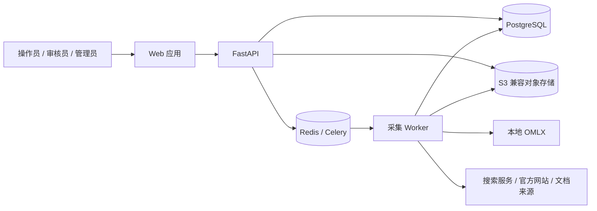
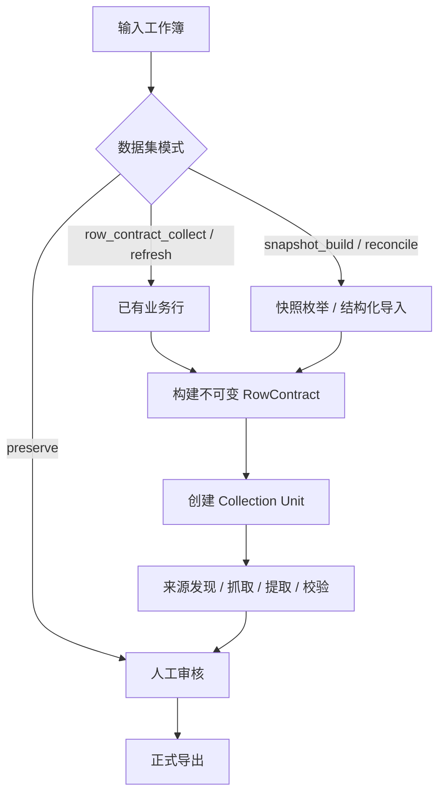
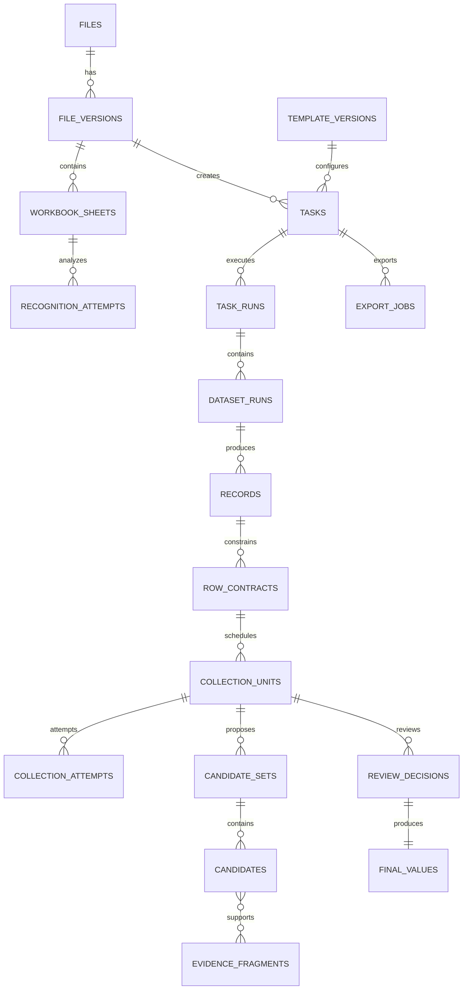

# metric-pulse-platform 系统设计

## 1. 文档信息

| 项目 | 内容 |
| --- | --- |
| 文档版本 | v1.1 |
| 状态 | 系统设计基线草案 |
| 更新日期 | 2026-08-23 |
| 目标项目 | `metric-pulse-platform` |
| 架构风格 | Python 模块化单体、API/worker 运行时分离、事件驱动协作 |

## 2. 设计结论

新系统采用 Python 全量重构，不复制旧 NestJS 业务实现。旧系统只承担三项作用：

1. 提供需求和历史行为参考；
2. 提供旧数据库迁移来源；
3. 提供回归测试样本。

新系统同时解决两类问题：

- 平台问题：上传、任务控制、状态查询、人工核对、权限、审计和导出门禁。
- 采集问题：`RowContract` 约束驱动采集、清单快照枚举、业务键对账、来源证据、复合结果组和完整工作簿构建。

正式导出必须经过人工审核门禁。系统可以在审核前生成内部预览产物，但预览不是正式导出。

## 3. 规模与质量假设

### 3.1 当前基线

- 目标工作簿包含 11 个业务工作表。
- 快速回归样本为 275 行。
- 完整输入基线约 11,996 条活跃行。
- 历史金标约 17,490 条活跃行。
- 单个工作表既可能有大量已有行，也可能只有表头或一条样例行。
- 同一任务可能同时包含逐行采集、完整快照构建、实体刷新、保留和结构化导入。

### 3.2 容量设计目标

首版单任务目标：

- 不超过 20 个参与处理的工作表；
- 不超过 50,000 条业务记录；
- 不超过 500,000 个普通字段；
- 不超过 100,000 个目标字段；
- 任务运行时间允许从数分钟到数天；
- 外部调用并发可按来源和模型分别限流。

数据库和对象存储按任务历史长期保留设计，不把完整正文塞入高频查询表。

## 4. 架构原则

1. PostgreSQL 是业务状态和审核事实的唯一来源。
2. Redis/Celery 只负责投递、限流和重试，不定义业务完成状态。
3. API 请求不执行长任务。
4. 处理单元是 `RowContract + target_group + task_run`。
5. 同一目标组字段共享证据链并原子提交。
6. 行号是坐标，不是业务身份。
7. 模板、提示词、规则、业务键和审核结果全部版本化。
8. 来源发现、内容抓取、数据提取、标准化、校验和审核分层。
9. 所有写操作幂等，所有状态转换检查预期版本。
10. 大文件、大正文和生成产物进入对象存储。
11. 异常优先审核，高质量结果支持受控批量确认。
12. 系统建议、人工事实和导出快照分别保存。

## 5. 系统上下文



## 6. 运行时组件

### 6.1 Web

- Vue 3 + TypeScript 单页应用，使用 Composition API 和 `<script setup>`。
- Element Plus 提供管理端基础组件；长审核队列使用独立虚拟化能力。
- Vue Router 5 内置文件路由根据 `src/pages` 生成强类型路由，路由元数据统一承载布局和权限要求。
- 通过生成的 TypeScript Client 调用 `/api/v1`。
- 通过 SSE 接收任务事件。
- 不保存业务真相，不自行推断状态转换。

### 6.2 API

- 认证、授权、请求校验和 OpenAPI。
- 文件上传、查询、命令受理和下载授权。
- 创建领域命令并在同一事务写入 outbox。
- 只执行短事务，不做 Excel 全量解析、网络抓取或模型推理。

### 6.3 Worker

按队列隔离不同资源类型：

- `workbook`：工作簿分析、预览、重建和导出；
- `planner`：任务规划、RowContract 和 collection unit 生成；
- `source`：来源发现、抓取和内容解析；
- `collection`：候选提取、标准化和验证；
- `maintenance`：租约恢复、缓存清理和统计校准。

不同队列使用不同并发和资源限制，避免 PDF 解析阻塞 OMLX 采集。

### 6.4 Scheduler / Outbox Dispatcher

- 持续发布尚未投递的 outbox 消息。
- 扫描过期 lease 并重新调度。
- 校准任务统计。
- 检测失联 worker 和卡住的运行实例。
- 触发数据保留和对象垃圾回收任务。

### 6.5 PostgreSQL

- 领域状态、用户、权限、模板和审计。
- 任务、运行实例、RowContract、记录、字段和候选索引。
- 来源元数据、审核事实和导出快照。
- outbox、幂等键、lease 和持久事件。

### 6.6 Redis

- Celery broker；
- 短期缓存；
- 分布式限流计数；
- SSE 唤醒通知；
- 用户会话。

Redis 数据丢失不应造成业务结果丢失。系统能够由 PostgreSQL outbox 和 lease 恢复投递。

### 6.7 对象存储

保存：

- 原始工作簿；
- 工作簿解析快照；
- 来源文件和抓取正文；
- 受控模型响应；
- JSONL/Parquet 调试产物；
- 内部预览工作簿；
- 正式导出。

对象键不使用用户原始文件名作为唯一键，使用租户、内容哈希和随机 ID 组合。

## 7. 领域模块

### 7.1 Identity

- 用户、角色和权限；
- 登录会话；
- API token 扩展；
- 操作人上下文。

### 7.2 File Intake

- 流式上传；
- 文件签名和安全检查；
- 内容哈希和重复识别；
- 原文件对象保存；
- 工作簿分析任务。

### 7.3 Workbook

- OOXML 工作表、单元格、合并区域、公式、数据验证和样式的确定性解析；
- 工作表全局缩略图和带坐标分片渲染；
- 本地多模态模型对表头、数据区域、字段角色和业务语义生成识别候选；
- 结构规则、视觉候选和已发布模板三方融合与冲突检测；
- 原始行快照；
- 业务键计算；
- RowContract 候选配置；
- 工作簿构建；
- 公式、样式、数据验证和冻结窗格回归检查。

### 7.4 Template

- 数据集 profile；
- 工作表匹配；
- 描述字段；
- 目标字段组；
- 字段类型和空值语义；
- 业务键版本；
- 来源策略；
- 采集模式；
- 验证和导出规则。

模板版本发布后不可修改，只能创建新版本。

### 7.5 Task Orchestration

- 用户任务；
- task run；
- dataset run；
- collection unit；
- 控制状态；
- 进度统计；
- lease、心跳和恢复；
- 领域事件。

### 7.6 Collection

- RowContract 构建；
- 搜索词和提示词渲染；
- 来源发现；
- 内容抓取和解析；
- 候选值提取；
- 确定性标准化；
- 复合结果校验；
- 评分和建议选择。

### 7.7 Dataset Snapshot

- 完整快照或增量来源读取；
- 清单记录枚举；
- 业务键对账；
- `INSERT/UPDATE/KEEP/RETIRE/CONFLICT`；
- 为枚举记录生成 RowContract。

### 7.8 Evidence

- 来源对象和内容哈希；
- 文本片段和定位；
- 来源权威级别；
- 候选与证据关系；
- 抓取时间和有效期。

### 7.9 Review

- 待审核队列；
- 批准、修正、驳回和跳过；
- 字段覆盖值；
- 版本冲突；
- 批量审核；
- 审核完成计算。

### 7.10 Export

- readiness；
- 审核快照；
- 内部预览与正式导出隔离；
- 原工作簿回填；
- 文件哈希和历史导出；
- 过期导出标记。

## 8. 统一采集模型

### 8.1 两类上游入口



### 8.2 RowContract

RowContract 是不可变值对象，冻结：

- 数据集和工作表；
- 输入文件版本；
- 当前行原始坐标；
- 当前行业务键；
- 描述字段的英文名、中文含义、原始值、规范值、必需性和空值语义；
- 目标字段组；
- 模板版本、提示词版本和规则版本；
- contract hash。

任务运行期间如果输入文件或模板版本改变，旧 contract 不能继续复用。

### 8.3 Target Group

目标字段组是采集和提交的原子边界。例如：

```text
metric_value_with_source =
  be_data + be_unit + data + unit + source_url + source_desc
```

不同工作表可以定义自己的组，例如备案信息、榜单名次、人员信息或产品参数。

组内字段可以由多个证据产生，但必须保存明确的证据和计算依赖，不允许无依据拼接。

### 8.4 Collection Unit

`collection_unit` 状态：

```text
PENDING → LEASED → RUNNING → SUCCEEDED
                     ├──────→ FAILED_RETRYABLE → PENDING
                     ├──────→ FAILED_FINAL
                     ├──────→ PAUSED
                     └──────→ DISCARDED
```

`DISCARDED` 表示运行版本已过期、任务已停止或输入 contract 已失效，worker 结果不得成为当前建议值。

### 8.5 处理步骤

一个 unit 内部按步骤执行，每步独立记录 attempt：

1. `PLAN_QUERY`：生成确定性查询和来源策略；
2. `DISCOVER_SOURCE`：发现候选来源；
3. `FETCH_SOURCE`：下载和缓存内容；
4. `EXTRACT_CONTENT`：PDF、HTML、Word、Excel 转换；
5. `RECOGNIZE_MEDIA`：对需要的图片或文档渲染页执行本地多模态识别；
6. `EXTRACT_CANDIDATE`：从单一来源提取结构化候选；
7. `NORMALIZE`：日期、数值、单位、实体和枚举标准化；
8. `VALIDATE`：RowContract、类型、范围和跨字段校验；
9. `RANK`：基于来源、匹配度和多来源一致性评分；
10. `COMMIT_SUGGESTION`：原子提交当前建议结果。

失败时从最小必要步骤重试，不重复下载和解析已有有效内容。

## 9. 状态模型

### 9.1 任务执行状态

```text
DRAFT → QUEUED → RUNNING → SUCCEEDED
            │        ├────→ SUCCEEDED_WITH_ERRORS
            │        ├────→ FAILED
            │        ├────→ PAUSING → PAUSED → QUEUED
            │        └────→ STOPPING → STOPPED
            └─────────────→ STOPPED
```

约束：

- `STOPPED` 是终态，重新运行必须创建新 `task_run`。
- `PAUSED` 恢复时沿用当前 run，不重置已完成结果。
- 任务状态不代表审核状态。
- `SUCCEEDED_WITH_ERRORS` 允许人工补充或针对失败 unit 创建新 run。

### 9.2 审核状态

```text
NOT_READY → PENDING → IN_PROGRESS → COMPLETED
```

目标字段组审核状态：

```text
UNREVIEWED → APPROVED
           → CORRECTED
           → REJECTED → 新的 collection unit
           → SKIPPED
```

### 9.3 导出状态

```text
BLOCKED → READY → GENERATING → AVAILABLE
                       └────→ FAILED
AVAILABLE → STALE
```

## 10. 可靠任务控制

### 10.1 幂等命令

每个写操作接收 `Idempotency-Key`。数据库保存：

- 用户；
- 接口和资源；
- request hash；
- response snapshot；
- 过期时间。

相同 key 和相同 request 返回原结果；相同 key 和不同 request 返回冲突。

### 10.2 原子状态转换

使用带预期状态和版本的更新：

```sql
UPDATE tasks
SET execution_status = :next_status,
    version = version + 1
WHERE id = :task_id
  AND version = :expected_version
  AND execution_status = ANY(:allowed_statuses);
```

更新行数为 0 时返回状态冲突，不做最后写入覆盖。

### 10.3 Outbox

命令事务同时写入业务表和 `outbox_events`。dispatcher 在事务外发布 Celery 消息，并标记投递时间。

消息至少包含：

- event ID；
- aggregate type 和 ID；
- task run ID；
- run version；
- event type；
- payload schema version。

消费者以 event ID 去重。

### 10.4 Lease

worker 领取 unit 时写入：

- `leased_by`；
- `leased_until`；
- `heartbeat_at`；
- `attempt_no`。

worker 周期续租。scheduler 只恢复超过宽限期且 worker 心跳失联的 lease。

### 10.5 暂停

- `RUNNING → PAUSING` 后停止产生和领取新 unit。
- 在途 unit 完成安全提交或在超时后释放。
- 当活动 lease 为 0 时进入 `PAUSED`。
- 恢复后重新投递待处理和可重试 unit。

### 10.6 停止

- `RUNNING/PAUSED/QUEUED → STOPPING`。
- 不再领取新 unit。
- 尝试取消 HTTPX 请求和支持 signal 的模型调用。
- 提交前校验 run version；停止后的迟到结果标记为 `DISCARDED`。
- 活动 lease 收敛后进入 `STOPPED`。

## 11. 数据设计

### 11.1 Schema 分区

建议使用逻辑 schema：

- `identity`：用户、角色和会话；
- `catalog`：文件、模板和来源配置；
- `work`：任务、运行、记录和采集；
- `review`：审核和最终值；
- `delivery`：导出；
- `ops`：outbox、幂等、审计和系统事件。

首版也可使用一个 schema 加统一前缀，重点是模块边界而不是物理 schema 数量。

### 11.2 核心实体

| 实体 | 关键字段 |
| --- | --- |
| `users` | id、username、password_hash、status、created_at |
| `roles`、`user_roles` | role、permission |
| `files` | id、owner_id、original_name、content_hash、object_key、size、status |
| `file_versions` | file_id、version、object_key、hash、created_at |
| `workbook_sheets` | file_version_id、sheet_key、name、position、profile_match、stats |
| `recognition_attempts` | subject type/id、input object/hash、model/prompt/schema version、proposal、validation、status、timing |
| `template_versions` | template_id、version、status、schema_json、content_hash |
| `tasks` | file_version_id、template_version_id、execution/review/export status、version |
| `task_runs` | task_id、run_no、run_version、status、started/ended/heartbeat |
| `dataset_runs` | task_run_id、dataset_id、mode、snapshot completeness、status |
| `records` | dataset_run_id、business_key、source row、raw_data、fingerprint |
| `row_contracts` | record_id、target_group、contract_json、contract_hash、versions |
| `collection_units` | row_contract_id、task_run_id、status、lease、retry、current_candidate_set |
| `collection_attempts` | unit_id、step、status、input/output refs、model、timing、error |
| `evidence_documents` | source URL、object key、content hash、metadata、retention |
| `evidence_fragments` | document_id、locator、text、fragment hash |
| `candidate_sets` | unit_id、algorithm version、selected candidate、score summary |
| `candidates` | candidate_set_id、values JSONB、validation、score、reason |
| `candidate_evidence` | candidate_id、fragment_id、field path、relation |
| `review_decisions` | unit_id、version、decision、field overrides、actor、comment |
| `final_values` | unit_id、review decision、values JSONB、version、effective_at |
| `export_jobs` | task_id、review snapshot version、status、object key、hash |
| `task_events` | task_id、sequence、type、payload、created_at |
| `outbox_events` | aggregate、type、payload、published_at |
| `idempotency_records` | actor、scope、key、request hash、response |
| `audit_logs` | actor、action、resource、before/after、request_id |

### 11.3 关系图



### 11.4 JSONB 使用边界

适合 JSONB：

- 模板配置；
- 原始行；
- RowContract；
- 候选复合值；
- 校验明细；
- 事件 payload。

必须普通列：

- 所有 ID 和外键；
- 状态；
- 版本；
- 业务键 hash；
- 用户和时间；
- lease、重试和统计；
- 需要频繁过滤和排序的字段。

### 11.5 索引

至少包括：

- task 状态 + created_at；
- task owner + status；
- task_run task_id + run_no unique；
- collection_unit task_run + status + leased_until；
- record dataset_run + business_key unique；
- row_contract contract_hash unique within file/template version；
- review unit + version unique；
- task_event task + sequence unique；
- outbox unpublished partial index；
- evidence content_hash；
- file content_hash + owner。

## 12. 搜索、抓取与模型设计

### 12.1 Source Adapter

统一接口：

```python
class SourceAdapter(Protocol):
    async def discover(self, request: DiscoveryRequest) -> list[SourceCandidate]: ...
    async def fetch(self, candidate: SourceCandidate) -> EvidenceDocument: ...
```

适配器分类：

- 官方结构化 API；
- 官方列表/附件；
- 搜索引擎；
- 通用网页；
- 用户上传文档；
- 内部结构化文件。

### 12.2 抓取安全

- 只允许 `http/https`；
- DNS 解析后阻止环回、链路本地、私网和云元数据地址；
- 每次重定向重新验证；
- 限制响应大小、时间和重定向次数；
- 内容类型白名单；
- 禁止将 OMLX 内网地址通过用户输入传入通用抓取器；
- OMLX endpoint 只能来自管理员配置。

### 12.3 OMLX Gateway

应用内部只依赖 `ModelGateway`：

```python
class ModelGateway(Protocol):
    async def generate_structured(
        self,
        request: StructuredGenerationRequest,
    ) -> StructuredGenerationResult: ...

    async def analyze_media(
        self,
        request: MediaAnalysisRequest,
    ) -> MediaAnalysisResult: ...
```

请求包含：

- model alias；
- system prompt version；
- user prompt；
- JSON Schema；
- timeout；
- trace metadata。

`MediaAnalysisRequest` 额外包含受控图片对象、MIME、像素尺寸、分片坐标和图像哈希。启动时对模型 alias 执行能力探测，验证图像输入、结构化输出、超时和最大输入约束；未通过时禁用视觉自动识别并显式告警。

网关负责鉴权、超时、并发、错误归一化和响应过滤，不把 API key 写入日志。

### 12.4 模型使用边界

模型适合：

- 非结构化内容理解；
- 复杂工作表版式、多层表头和字段语义识别；
- 网页、PDF 和附件图片中的文字、表格和图表语义抽取；
- 实体和口径匹配；
- 从证据提取结构化候选；
- 生成可验证的来源摘要。

模型不负责：

- 定义实际 OOXML 单元格值、公式、坐标或合并区域；
- 绕过结构校验直接发布字段映射；
- 业务状态转换；
- 直接写数据库；
- 最终决定审核通过；
- 隐式货币或单位计算；
- 生成没有证据的事实；
- 生成或执行任意代码。

单位和数值转换由确定性规则复算。

### 12.5 工作簿识别融合

新系统不携带旧服务的“Sheet 名前缀 + 前两行 `logic_id` + 写死 Profile”主路径。工作簿识别流程为：

1. `StructureExtractor` 从 OOXML 生成 `WorkbookStructureGraph`；
2. `SheetRenderer` 生成全局缩略图与带 A1 坐标的高清分片；
3. `TemplateRetriever` 根据结构签名召回已发布模板；
4. `VisionRecognizer` 输出 header ranges、data regions、descriptor fields、target groups、business-key candidates 和可读理由；
5. `RecognitionFusion` 用实际单元格、合并区域、字段唯一性、类型分布和模板差异交叉校验；
6. 确定签名命中已确认模板时直接复用；新结构只在关键约束全部通过时自动接受；
7. 冲突、越界、必需字段缺失或业务键不稳定时进入 `NEEDS_CONFIRMATION`。

置信度由模板相似度、结构规则、模型候选一致性和冲突数联合校准，不直接采信模型自报分数。用户确认的结果保存为新模板版本，使后续同类文件走低成本快速路径。

### 12.6 图片证据识别

新系统不将 Tesseract + 灰度/二值化作为图片理解主路径。原图经安全检查、尺寸限制和必要分片后发送到本地视觉模型，输出必须通过任务 JSON Schema。证据保存原图 hash、分片坐标、模型 alias/实际版本、量化、Prompt 版本、原始受控响应和解析结果。

如视觉能力不可用，图片证据标记为 `MEDIA_RECOGNITION_UNAVAILABLE`，改用 HTML 可访问文本、替代来源或人工核对；不得在无告警的情况下当作“图片中没有数据”。

## 13. 工作簿设计

### 13.1 读取

- 以流式上传文件保存后的对象为输入；
- 使用 openpyxl 读取工作簿结构和单元格；
- 同时保存 `raw_value`、`display_value`、公式和样式引用；
- 生成工作簿结构签名，并将可能的多层表头交给识别融合流程；
- 原工作簿只读。

### 13.2 构建

- 从原文件复制到新的构建对象；
- 按业务键确定 `INSERT/UPDATE/KEEP/RETIRE/CONFLICT`；
- 重建目标数据区，而不是依赖旧行号跨版本写回；
- 将审核后的最终值写入目标字段；
- 扩展公式、样式、数据验证和冻结窗格；
- 防止以 `= + - @` 开头的非公式文本发生公式注入。

### 13.3 验证

- 工作表名称和顺序；
- 表头签名；
- 业务键集合；
- 字段值和类型；
- 公式覆盖范围；
- 数据验证；
- 样式抽样和关键区域检查；
- Excel 错误公式扫描；
- LibreOffice headless 可选重算和 PDF/图片渲染抽查。

## 14. API 与事件架构

### 14.1 API

- `/api/v1` 版本前缀；
- OpenAPI 是契约；
- 命令返回 `202 Accepted` 和资源当前状态；
- 查询返回强类型分页对象；
- 写操作使用 idempotency key 和 expected version；
- 错误返回稳定 code、message、details、requestId。

### 14.2 SSE

任务事件同时持久化到 `task_events` 并通过 Redis pub/sub 唤醒连接。

客户端提交 `Last-Event-ID` 后：

1. API 从 PostgreSQL 补发缺失事件；
2. 再订阅 Redis 实时通知；
3. Redis 通知丢失时，客户端仍可重连补取。

## 15. 安全架构

### 15.1 认证

- 浏览器使用同源 HTTP-only、Secure、SameSite 会话 Cookie；
- Redis 保存活动 session，PostgreSQL 保存用户和安全事件；
- 写请求使用 CSRF token；
- 后续自动化客户端使用可撤销 API token。

### 15.2 授权

角色：

- `ADMIN`；
- `OPERATOR`；
- `REVIEWER`；
- `VIEWER`。

资源同时检查角色和任务所属 workspace。首版可以只有一个 workspace，但数据模型保留边界。

### 15.3 密钥

- OMLX、搜索、对象存储和数据库凭据通过环境或 Docker secret 注入；
- 配置 API 只显示是否配置，不回传密钥；
- 日志统一脱敏；
- Git 中只提供 `.env.example`。

### 15.4 审计

以下操作必须审计：

- 登录失败和权限拒绝；
- 文件上传和下载；
- 创建、启动、暂停、恢复、停止和删除任务；
- 单条和批量审核；
- 模板发布；
- 正式导出；
- 管理配置变更。

## 16. 性能与资源治理

### 16.1 限流层次

- 每用户 API 限流；
- 每 workspace 同时运行任务数；
- 每来源域名并发和 QPS；
- OMLX 全局并发；
- 文档解析并发；
- 单任务预算。

### 16.2 缓存

- 搜索结果按规范化查询、来源策略和时间窗口缓存；
- 抓取内容按 URL + ETag/Last-Modified + content hash 缓存；
- 模型结果只在 RowContract、证据 hash、提示词版本、模型 alias 和规则版本全部相同时复用；
- 人工审核结果复用必须由模板策略明确允许。

### 16.3 批处理

数据库批量插入 records 和 contracts，但模型上下文保持逐行隔离。

可把多个 unit 放入同一 Celery 消息降低队列开销，但 worker 必须逐个领取、记录和提交，单个失败不回滚整个批次。

## 17. 可观测性

### 17.1 日志

结构化 JSON，至少包含：

- request_id；
- user_id；
- task_id；
- task_run_id；
- dataset_run_id；
- collection_unit_id；
- attempt_id；
- event；
- duration_ms；
- error_code。

不得记录完整密钥、Cookie、敏感来源凭据和模型隐藏思维内容。

### 17.2 指标

- API 延迟和错误率；
- 队列深度；
- active/expired lease；
- worker 心跳；
- 每来源成功率和延迟；
- OMLX 延迟、错误和并发；
- 文本/视觉请求队列深度、识别耗时和能力探测状态；
- 工作簿识别自动接受率、冲突率、人工修正率和金标回归结果；
- 候选覆盖率；
- 证据覆盖率；
- 审核耗时和修正率；
- 导出失败率。

### 17.3 健康检查

- `/health/live`：进程存活；
- `/health/ready`：数据库、Redis、对象存储基本可用；
- OMLX 单独展示健康状态，不一定阻止只读 API ready。

## 18. 部署设计

### 18.1 Docker Compose 服务

```text
web
api
worker-workbook
worker-source
worker-vision
worker-collection
scheduler
postgres
redis
object-storage（可选，若使用外部 KS3 则不部署）
```

### 18.2 NAS 网络

- 对外只暴露 Web/API 入口；
- PostgreSQL、Redis 和对象存储使用内部网络；
- OMLX 使用管理员配置的局域网固定地址；
- Synology 反向代理负责域名和 TLS；
- CORS 配置为实际前端域名；
- 容器使用健康检查和 restart policy。

### 18.3 持久卷

- PostgreSQL data；
- Redis AOF；
- 对象存储 data；
- 备份 staging；
- 不依赖 API/worker 容器本地磁盘保存业务文件。

### 18.4 备份

- PostgreSQL 每日逻辑备份，关键版本前物理快照；
- 对象存储按任务和保留策略备份；
- 备份包含数据库版本和对象清单；
- 每季度执行恢复演练；
- 正式导出和审计记录纳入备份。

## 19. 旧系统迁移

### 19.1 原则

- 旧服务保持只读运行，直到新系统完成验收；
- 不在旧库上直接执行新系统 migration；
- 使用独立迁移 CLI 读取旧 MySQL，写入新 PostgreSQL；
- 每个迁移批次生成对账报告；
- 不迁移明文密钥。

### 19.2 映射

- `files` → 新 files/file_versions；
- `tasks` → legacy tasks/task_runs；
- `data_records.raw_data` → records；
- `target_fields` → 初始 target group 候选；
- `search_results` → evidence discovery metadata；
- `processed_data` → legacy candidate，不自动认定 final value；
- `is_reviewed=1` → legacy review decision，要求保留来源标记。

### 19.3 切换

1. 新系统完成离线基线；
2. 迁移历史数据副本；
3. 新旧系统并行跑同一批任务；
4. 比较任务、结果、证据和工作簿；
5. 冻结旧系统写入；
6. 最终增量迁移；
7. 前端切换；
8. 旧系统保留只读观察期后归档。

## 20. 测试策略

### 20.1 单元测试

- 状态机；
- RowContract；
- 业务键；
- 空值语义；
- 单位和日期标准化；
- 候选评分；
- readiness；
- Excel 公式注入防护。

### 20.2 属性测试

使用 Hypothesis 检查：

- 状态机不存在非法跃迁；
- 幂等命令重复执行结果一致；
- 单位转换往返和范围；
- 业务键规范化稳定；
- 随机空值和特殊字符不会破坏工作簿。

### 20.3 集成测试

- PostgreSQL 锁、lease 和 outbox；
- Redis/Celery 重试；
- S3 对象上传、下载和清理；
- worker 强制退出恢复；
- OpenAPI contract；
- SSRF 和下载限制；
- OMLX 图像输入、结构化响应和能力探测合约；
- 工作簿渲染、分片坐标和识别融合门禁。

### 20.4 端到端

- 275 行快速回归；
- 275 行文件的结构/视觉识别及变体金标回归；
- 11,996 → 17,490 历史金标离线回归；
- 暂停、恢复和停止；
- 并发启动；
- 审核冲突；
- 导出门禁；
- 原工作簿回填和格式验证。

## 21. 实施阶段

### 阶段 A：工程与可靠底座

- 工程骨架、质量工具和 CI；
- PostgreSQL、Redis、S3 和 Docker Compose；
- 认证、权限和审计；
- 文件上传和对象存储；
- task/task_run/outbox/lease；
- worker 恢复和状态机。

### 阶段 B：工作簿与任务规划

- 工作簿解析；
- 工作表渲染、视觉能力探测和识别融合；
- 模板版本；
- RowContract；
- dataset mode 和业务键；
- 275 行规划验收。

### 阶段 C：采集与证据

- 来源适配器；
- 抓取缓存；
- 文档转换；
- OMLX gateway；
- 候选提取、标准化、验证和评分；
- 字段组原子提交。

### 阶段 D：审核与导出

- 审核 API 和冲突处理；
- 批量审核；
- readiness；
- 审核快照；
- 工作簿回填和正式导出。

### 阶段 E：优化与迁移

- 历史结果复用；
- 权威来源适配器；
- 完整金标回归；
- 旧数据迁移；
- NAS 正式切换。

## 22. 关键风险

| 风险 | 应对 |
| --- | --- |
| openpyxl 无法完全保留高级 Excel 特性 | 用真实文件回归；建立 WorkbookEngine 端口；必要时引入 LibreOffice 辅助 |
| Celery 消息和数据库状态不一致 | outbox、幂等消费、lease 和恢复扫描 |
| 通用搜索质量低、人工仍多 | 优先建设权威来源适配器和历史审核安全复用 |
| 模型结果格式和质量波动 | JSON Schema、提示词版本、确定性校验、黄金数据集 |
| 多模态模型幻觉单元格坐标或字段角色 | OOXML 事实层交叉校验，关键冲突强制人工确认 |
| 视觉请求占满本地 OMLX | 交互/批处理分类队列、全局并发上限、已发布模板快速路径 |
| 任务暂停/停止后迟到写入 | run version、提交前状态检查、DISCARDED 状态 |
| 数据量增大导致审核页面变慢 | 服务端分页、字段摘要、正文按需加载、索引和只读投影 |
| 旧需求两套口径冲突 | 把预览产物和正式导出分开；正式导出始终受审核门禁控制 |

## 23. 系统设计完成条件

在进入全面编码前，应完成：

1. 本文和 ADR 评审通过；
2. 领域状态机测试样例确认；
3. 核心 ER 模型和索引评审；
4. OpenAPI 第一版冻结；
5. 275 行和完整金标 Fixture 的合法使用与存储方式确认；
6. NAS 上 PostgreSQL、Redis、worker、对象存储和 OMLX 连通性刺探；
7. Excel 保真度刺探；
8. OMLX 视觉合约、275 行/变体金标和识别融合门禁刺探；
9. 正式导出严格门禁和 `SKIPPED` 语义确认。
